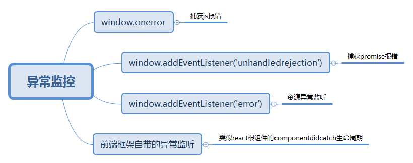

# 前端监控平台
## 异常监控

## 性能监控

**单页面中的性能监控可能存在的问题**

在本人使用的react的项目中(本人的自定义根组件为  App  )，
componentWillMount  的  performance.now  的时间，大于  window.onload  中  performance.now  的时间，并且  entrys  数组中只有navigation的entry  ，和几个  resoruce  类型的entry，而没有用作监控渲染的   paint  类型的  entry  。(尽管此时写有  window.onload  的脚本已经放置于  body  中最下方)。
事实上，直接在  componentDidMount  中，直接获取  entrys  数组，其中也没有  paint  类型的  entry。所以dom挂载完毕，不代表渲染绘制完毕。
毕竟动态创建元素后，将触发的是浏览器的回流和重绘，只有重绘完毕，才算是渲染绘制完毕。

**解决方案/思路：**

通过轮询监控paint的entry是否加载提供完毕来确定采集结束时机，然后利用first paint和first-contentful-paint进行计算处理(兼容性不够好)。

**采集误差**
stalled时间，及阻塞暂停时间，多发生在：

同域名tcp链接并发限制(常见)
浏览器正在分配缓存空间
有更高优先级请求正在处理

**方案：**

上报页面加载开始时间，即fetchStart
上报后续各时间点的相对增量(timeline中的navigation类型的entry已经实现)
进行阶段清洗和异常处理

## 项目结构

**待优化：**

1.报错日志离线存储，在浏览器空闲时候上报

2.性能数据的准确性

3.性能数据更好的展示方式